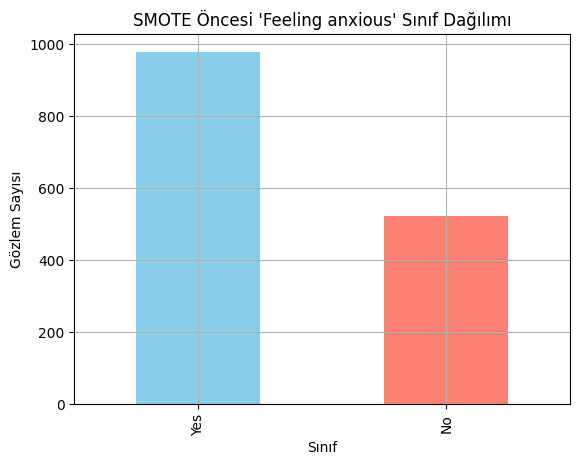
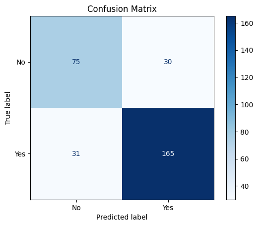
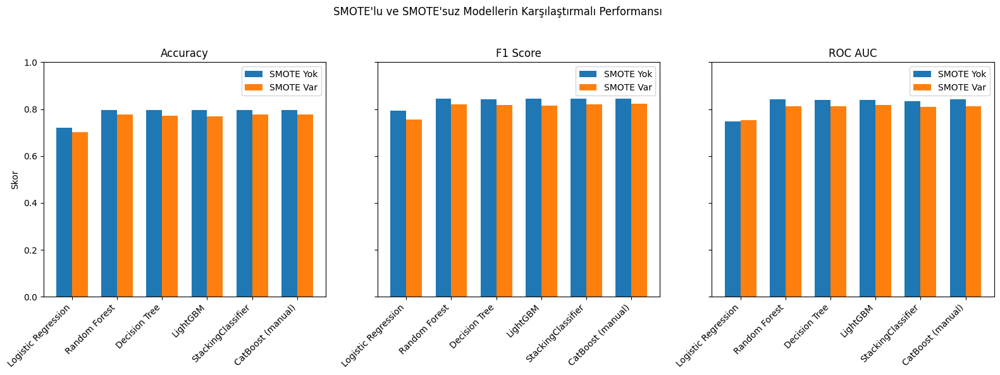

# Postpartum Depression Prediction Project

### INTRODUCTION –---

152120221051 Elif Suna GEGİN
152120211072 Resul EVLEKSİZ
152120221094 Kadriye HARMANCI

#### Project Objective  
Our project aims to build machine learning models to **predict the risk of postpartum depression (PPD)** using self-reported postnatal data. We use the variable **“Feeling anxious”** as a proxy for identifying individuals likely to experience postpartum depression, as anxiety is a common and early symptom of PPD.

#### Why It Matters?
Postpartum depression can significantly affect the well-being of both the parent and the child. Early detection using data-driven methods can enable healthcare professionals to intervene more effectively and support mental health recovery.

#### Scope of the Project  
- Predict the presence of postpartum anxiety using the **“Feeling anxious”** variable.  
- Analyze emotional, behavioral, and psychological factors collected from individuals in the postnatal period.  
- Apply and compare classification models such as Logistic Regression, Random Forest, LightGBM, CatBoost, and Stacking.  
- Address class imbalance through oversampling techniques like **SMOTE**.  
- Evaluate model performance using metrics including F1 Score, ROC-AUC, and Precision-Recall curves.

#### Dataset Information  
The dataset used in this project was sourced from **Kaggle**. It consists of self-reported responses from individuals in the postpartum period and includes approximately **1503 rows** and **11 columns**.  
The features capture a wide range of emotional and behavioral indicators such as appetite changes, sleep disturbances, guilt, bonding with the baby, and anxiety symptoms, making it suitable for mental health risk prediction.


```python
# CELL 1: Importing Libraries
import pandas as pd
import numpy as np
import matplotlib.pyplot as plt
import seaborn as sns
from sklearn.model_selection import train_test_split, GridSearchCV
from sklearn.preprocessing import LabelEncoder, StandardScaler, OneHotEncoder
from sklearn.pipeline import Pipeline
from sklearn.compose import ColumnTransformer
from sklearn.impute import SimpleImputer
from sklearn.linear_model import LogisticRegression
from sklearn.tree import DecisionTreeClassifier
from sklearn.ensemble import RandomForestClassifier, StackingClassifier, GradientBoostingClassifier
from sklearn.metrics import accuracy_score, precision_score, recall_score, f1_score, roc_auc_score, classification_report, roc_curve, auc
from lightgbm import LGBMClassifier
import warnings
warnings.filterwarnings("ignore")
```

## 2. Loading and Initial Data Inspection

* We will load the dataset from the csv file.
* Perform initial checks to understand the data structure, columns, and data types.
* Look for missing values and get a summary of the data.

---


```python
# CELL 2: Loading Dataset
print("CELL 2 Running: Loading dataset...")
df = pd.read_csv('post natal data.csv')
print("Data shape:", df.shape)
```

    CELL 2 Running: Loading dataset...
    Data shape: (1503, 11)
    

# 3. Target Variable Distribution and Missing Data Overview / EDA

In this step, we explore the class distribution of the target variable (`Feeling anxious`).  
This helps us understand whether the dataset is imbalanced, which is important for model evaluation.  
We also visualize the location of missing values in the dataset using a heatmap to identify which columns require imputation.


```python
print("Target variable distribution:")
print(df['Feeling anxious'].value_counts())

sns.heatmap(df.isnull(), cbar=False, yticklabels=False)
plt.title("Eksik Veriler")
plt.show()

```

    Target variable distribution:
    Feeling anxious
    Yes    980
    No     523
    Name: count, dtype: int64
    


    

    


### 3.1 Feature-Target Relationship: Overeating vs Feeling Anxious

This plot shows how the presence of overeating or appetite loss relates to anxiety symptoms.


```python
sns.countplot(x='Overeating or loss of appetite', hue='Feeling anxious', data=df)
plt.title("Anxiety Distribution by Overeating")
plt.xlabel("Overeating or loss of appetite")
plt.ylabel("Count")
plt.show()

```


    

    


### 3.2 Missing Data Percentage Overview

In addition to the missing value heatmap, this step provides a precise percentage of missing values in each feature.  
Understanding the extent of missing data helps in choosing the right imputation strategy.


```python
# CELL 3.2: Missing Data Percentage Summary

# Calculate percentage of missing values in each column
missing_percentages = df.isnull().mean().sort_values(ascending=False) * 100
missing_percentages = missing_percentages[missing_percentages > 0]

# Display missing data percentages
print("Missing Data (%):")
print(missing_percentages)

# Visualize missing data percentages
plt.figure(figsize=(10, 4))
sns.barplot(x=missing_percentages.index, y=missing_percentages.values)
plt.title("Missing Data by Feature (%)")
plt.ylabel("Percentage")
plt.xticks(rotation=45)
plt.tight_layout()
plt.show()

```

    Missing Data (%):
    Problems concentrating or making decision    0.798403
    Feeling of guilt                             0.598802
    Irritable towards baby & partner             0.399202
    dtype: float64
    


    

    


# 4. Initial Data Cleaning and Ambiguous Value Handling

Some responses in the dataset contain vague or non-standard answers such as "Maybe", "Often", or "Not interested to say".  
These values are not informative and may hinder the modeling process.  
To address this, we replace them with `NaN` values so they can be handled systematically in the imputation step that follows.


```python
# CELL 3: Initial Inspection & Preprocessing
# Belirsiz kategorileri NaN ile değiştiriyoruz
df.replace({
    "Feeling of guilt": {"Maybe": np.nan},
    "Problems concentrating or making decision": {"Often": np.nan},
    "Suicide attempt": {"Not interested to say": np.nan}
}, inplace=True)

print("CELL 3 Running: Preprocessing...")

```

    CELL 3 Running: Preprocessing...
    

### 4.1 Encoding Strategy

To prepare the data for machine learning algorithms, we apply:
- Ordinal encoding for age ranges.
- Label encoding for binary and ordinal features.
- One-hot encoding for nominal features that are non-ordinal and have multiple categories.


```python
# CELL 4: Handling Missing Values and Encoding
print("CELL 4 Running: Handling Missing Values and Encoding...")
# Belirsiz cevaplardan kaynaklı eksik değerleri en sık görülenle doldur
cols_to_impute = [
    "Irritable towards baby & partner",
    "Problems concentrating or making decision",
    "Feeling of guilt"
]
imp = SimpleImputer(strategy='most_frequent')
df[cols_to_impute] = imp.fit_transform(df[cols_to_impute])


# Encode categorical data
feature_columns = [
    'Irritable towards baby & partner',
    'Problems of bonding with baby',
    'Suicide attempt',
    'Overeating or loss of appetite'
]
X = df[feature_columns]
y = df["Feeling anxious"]

# One-hot encoding ile kategorik verileri dönüştür
X_encoded = pd.get_dummies(X, drop_first=True)


le_target = LabelEncoder()
y_encoded = le_target.fit_transform(y)
```

    CELL 4 Running: Handling Missing Values and Encoding...
    

### 6. Correlation Matrix Between Selected Features and Target Variable

In this step, we calculate and visualize the **correlation matrix** between selected features and the target variable (`Feeling anxious`):

- The target column is temporarily added back to the feature set.
- Categorical variables are converted to numerical format using `pd.factorize()`, ensuring compatibility with correlation calculations.
- A heatmap is generated to show the linear correlation between all variables.

> This helps identify potential multicollinearity between features and shows how strongly each variable is related to the target.


```python
# Seçilen feature ve hedef sütunları birleştir
corr_df = X.copy()
corr_df['Feeling anxious'] = y

# Kategorik değişkenleri sayısala çevir (gerekirse)
corr_df_encoded = corr_df.apply(lambda col: pd.factorize(col)[0] if col.dtype == 'object' else col)

# Korelasyon matrisi
plt.figure(figsize=(8, 6))
sns.heatmap(corr_df_encoded.corr(), annot=True, cmap='coolwarm', fmt=".2f")
plt.title("Seçilen Özellikler ve Hedef için Korelasyon Matrisi")
plt.tight_layout()
plt.show()
```


    

    


### 7. Train-Test Split and Preprocessing

The dataset is split into training and testing sets with stratification to preserve class balance.  
Then, StandardScaler is applied using a ColumnTransformer to normalize the features before training.


```python
# CELL 4.5: Train/Test Split & Preprocessor (Son Hali)
from sklearn.preprocessing import StandardScaler
from sklearn.compose import ColumnTransformer

numeric_features = X_encoded.columns # Tüm sütunlar sayısal kabul ediliyor

preprocessor = ColumnTransformer(
    transformers=[
        ('num', StandardScaler(), numeric_features)
    ])

X_train, X_test, y_train, y_test = train_test_split(X_encoded, y_encoded, test_size=0.2, random_state=42, stratify=y_encoded)

print("CELL 4.5 Running: Preprocessor created. Train/test split is handled by K-Fold Cross-Validation.")
```

    CELL 4.5 Running: Preprocessor created. Train/test split is handled by K-Fold Cross-Validation.
    

### 8. Final Data Type Check and Boolean Conversion

Before model training, we ensure that all features are in a compatible numeric format.

- Boolean values, if any, are explicitly converted to integers (`True` → 1, `False` → 0).
- A data type check is performed on the training dataset to verify that all features are numeric.

> This is a safety step to avoid type-related issues during model training or pipeline transformations.


```python
from sklearn.preprocessing import FunctionTransformer

# Boolean varsa int'e çevir
X_train = X_train.applymap(lambda x: int(x) if isinstance(x, (bool, np.bool_)) else x)

# Son kontroller
print(X_train.dtypes.value_counts())

```

    int64    7
    Name: count, dtype: int64
    

### 9. Training and Evaluating Models Without SMOTE

In this step, we train all models on the original dataset **without applying any resampling** technique like SMOTE.  
This provides a baseline to compare with the SMOTE-enhanced results later.

Key points:
- A new train-test split is performed on the original encoded dataset.
- A consistent pipeline is used for each model, including preprocessing.
- The following metrics are calculated:
  - Accuracy
  - F1 Score
  - ROC AUC

> This baseline evaluation helps quantify the impact of data imbalance on model performance.


```python
# CELL 11: Train and Evaluate Models WITHOUT SMOTE
models = {
    "Logistic Regression": LogisticRegression(max_iter=1000, solver='liblinear'),
    "Random Forest": RandomForestClassifier(random_state=42),
    "Decision Tree": DecisionTreeClassifier(random_state=42),
    "LightGBM": LGBMClassifier(random_state=42, verbosity=-1),
    "StackingClassifier": StackingClassifier(
        estimators=[
            ('rf', RandomForestClassifier(random_state=42)),
            ('dt', DecisionTreeClassifier(random_state=42)),
            ('lr', LogisticRegression(max_iter=1000, solver='liblinear'))
        ],
        final_estimator=LogisticRegression()
    )
}

try:
    from catboost import CatBoostClassifier
    models["CatBoost (manual)"] = CatBoostClassifier(verbose=0, random_state=42)
except:
    pass
print("CELL 11 Running: Training models without SMOTE...")

results_nosmote = {}

X_no = X_encoded.copy()
y_no = y_encoded.copy()

# Veri tekrar bölünüyor (SMOTE uygulanmadan önceki haliyle)
X_train_no, X_test_no, y_train_no, y_test_no = train_test_split(X_no, y_no, test_size=0.2, random_state=42, stratify=y_no)

for name, model in models.items():
    if name == "CatBoost (manual)":
        model.fit(X_train_no, y_train_no)
        y_pred = model.predict(X_test_no)
        y_proba = model.predict_proba(X_test_no)[:, 1]
    else:
        pipe = Pipeline(steps=[('preprocessor', preprocessor), ('classifier', model)])
        pipe.fit(X_train_no, y_train_no)
        y_pred = pipe.predict(X_test_no)
        y_proba = pipe.predict_proba(X_test_no)[:, 1]

    results_nosmote[name] = {
        "Accuracy": accuracy_score(y_test_no, y_pred),
        "F1 Score": f1_score(y_test_no, y_pred),
        "ROC AUC": roc_auc_score(y_test_no, y_proba)
    }

```

    CELL 11 Running: Training models without SMOTE...
    

### 9.1. ROC Curve Comparison (Without SMOTE)

This additional plot illustrates how models perform **without any class balancing**.  
Since the training data is imbalanced, many models may struggle to correctly identify the minority class.

- AUC scores are generally lower compared to SMOTE-enhanced training.
- This serves as a **baseline** to demonstrate the impact of class imbalance.

> Conclusion: Balancing the training data significantly improves model discrimination ability.


```python
# CELL 9.5: ROC Curves Without SMOTE

from sklearn.metrics import roc_curve, auc

# Re-create models dictionary if it was overwritten
model_dict = {
    "Logistic Regression": LogisticRegression(max_iter=1000, solver='liblinear'),
    "Random Forest": RandomForestClassifier(random_state=42),
    "Decision Tree": DecisionTreeClassifier(random_state=42),
    "LightGBM": LGBMClassifier(random_state=42, verbosity=-1),
    "StackingClassifier": StackingClassifier(
        estimators=[
            ('rf', RandomForestClassifier(random_state=42)),
            ('dt', DecisionTreeClassifier(random_state=42)),
            ('lr', LogisticRegression(max_iter=1000, solver='liblinear'))
        ],
        final_estimator=LogisticRegression()
    )
}

try:
    from catboost import CatBoostClassifier
    model_dict["CatBoost (manual)"] = CatBoostClassifier(verbose=0, random_state=42)
except:
    pass

plt.figure(figsize=(8, 6))
plt.plot([0, 1], [0, 1], 'k--', label='Random (AUC = 0.5)')

for name, model in model_dict.items():
    if name == "CatBoost (manual)":
        model.fit(X_train_no, y_train_no)
        y_proba = model.predict_proba(X_test_no)[:, 1]
    else:
        pipe = Pipeline(steps=[('preprocessor', preprocessor), ('classifier', model)])
        pipe.fit(X_train_no, y_train_no)
        y_proba = pipe.predict_proba(X_test_no)[:, 1]
    
    fpr, tpr, _ = roc_curve(y_test_no, y_proba)
    auc_score = auc(fpr, tpr)
    plt.plot(fpr, tpr, label=f'{name} (AUC = {auc_score:.3f})')

plt.xlabel('False Positive Rate')
plt.ylabel('True Positive Rate')
plt.title('ROC Curve (Without SMOTE)')
plt.legend(loc='lower right')
plt.grid(True)
plt.tight_layout()
plt.show()

```


    

    


### 10. Class Distribution Before SMOTE

This bar chart visualizes the distribution of the target variable (`Feeling anxious`) before applying SMOTE.  
It highlights the **class imbalance** problem, which can negatively affect model performance by biasing predictions toward the majority class.

> This imbalance is the main reason why SMOTE will be applied later to balance the training data.


```python
# SMOTE öncesi sınıf dağılımı
df["Feeling anxious"].value_counts().plot(kind='bar', color=['skyblue', 'salmon'])
plt.title("SMOTE Öncesi 'Feeling anxious' Sınıf Dağılımı")
plt.ylabel("Gözlem Sayısı")
plt.xlabel("Sınıf")
plt.grid(True)
plt.show()
```


    

    


### 11. Confusion Matrix Visualization

The confusion matrix provides a detailed view of classification results:

- **True Positives (TP):** Correctly predicted positive cases  
- **True Negatives (TN):** Correctly predicted negative cases  
- **False Positives (FP):** Incorrectly predicted as positive  
- **False Negatives (FN):** Incorrectly predicted as negative

> This visualization helps interpret the model’s strengths and weaknesses in classification, especially for imbalanced datasets.


```python
from sklearn.metrics import ConfusionMatrixDisplay
ConfusionMatrixDisplay.from_predictions(y_test, y_pred, display_labels=["No", "Yes"], cmap="Blues")
plt.title("Confusion Matrix")
plt.grid(False)
plt.show()

```


    

    


### 12. Balancing the Dataset with SMOTE

In this step, we apply **SMOTE (Synthetic Minority Over-sampling Technique)** to the training data only.

- SMOTE creates synthetic samples of the minority class by interpolating between existing observations.
- This helps reduce bias in the classifier toward the majority class.
- The new class distribution is printed after resampling.

> ⚠️ Note: SMOTE is applied only to the training data to avoid data leakage during validation or testing.


```python
# CELL 5: Balancing the Dataset with SMOTE
print("CELL 5 Running: Applying SMOTE to training data only...")

from imblearn.over_sampling import SMOTE
smote = SMOTE(random_state=42)
X_train, y_train = smote.fit_resample(X_train, y_train)

print("After SMOTE - Class distribution:")
print(pd.Series(y_train).value_counts())

```

    CELL 5 Running: Applying SMOTE to training data only...
    After SMOTE - Class distribution:
    0    784
    1    784
    Name: count, dtype: int64
    

### 13. Defining Classification Models

In this step, we define a dictionary of classifiers that will be used in model evaluation.  
The models include a mix of simple, ensemble, and boosting-based algorithms:

- **Logistic Regression** — A linear baseline classifier.  
- **Decision Tree** — A non-linear tree-based model.  
- **Random Forest** — An ensemble method using bagging.  
- **LightGBM** — A fast and efficient gradient boosting method.  
- **CatBoost** — A boosting algorithm particularly effective with categorical data.  
- **StackingClassifier** — A meta-model that combines multiple classifiers for improved performance.

We also initialize:
- `roc_curves_data`: stores false positive/true positive values for ROC plots.  
- `model_predictions`: stores test labels and predicted probabilities for Precision-Recall analysis.

> These models will later be evaluated using stratified cross-validation.


```python
# CELL 6: Define Models
print("CELL 6 Running: Defining models...")
import numpy as np # Bu satırı da eklemek iyi bir pratik, bazı modellerin iç parametreleri için gerekebilir.
from sklearn.linear_model import LogisticRegression
from sklearn.tree import DecisionTreeClassifier
from sklearn.ensemble import RandomForestClassifier, StackingClassifier
from lightgbm import LGBMClassifier
from catboost import CatBoostClassifier

# Define base estimators for StackingClassifier
estimators = [
    ('lr', LogisticRegression(random_state=42, solver='liblinear')), # solver='liblinear' added for compatibility
    ('dt', DecisionTreeClassifier(random_state=42)),
    ('rf', RandomForestClassifier(random_state=42))
]

# Define models dictionary with unfitted models
models = {
    "Logistic Regression": LogisticRegression(random_state=42, solver='liblinear'),
    "Random Forest": RandomForestClassifier(random_state=42),
    "Decision Tree": DecisionTreeClassifier(random_state=42),
    "LightGBM": LGBMClassifier(random_state=42),
    "StackingClassifier": StackingClassifier(estimators=estimators, final_estimator=LogisticRegression(random_state=42, solver='liblinear'), cv=5),
    "CatBoost (manual)": CatBoostClassifier(random_state=42, verbose=0) # verbose=0 to suppress output during training
}

# Sonuçları, ROC eğrisi verilerini ve tahminleri depolamak için sözlükler
results = {} # Bu artık kullanılmıyor, yerine cv_results kullanılacak.
roc_curves_data = {} # ROC eğrisi verileri (K-Fold ile birleştirilmiş)
model_predictions = {} # ADDED: K-Fold tahminlerini depolamak için sözlük (y_test ve y_proba)
```

    CELL 6 Running: Defining models...
    

### 14. Training and Evaluating Models with SMOTE and Stratified K-Fold Cross-Validation

This step performs model training and evaluation using **Stratified K-Fold Cross-Validation (5 folds)** on a dataset that is balanced using **SMOTE**.

Key details:
- Each fold maintains class distribution (`StratifiedKFold`).
- **SMOTE is applied only to the training fold**, ensuring no data leakage.
- A pipeline is used for each model (except CatBoost), which includes preprocessing and classification.
- The following evaluation metrics are calculated per fold and then averaged:
  - Accuracy
  - Precision
  - Recall
  - F1 Score
  - ROC AUC
- ROC and Precision-Recall data are also stored for each model for visualization.

> This approach ensures a fair and robust evaluation of each model on balanced data.


```python
# CELL 7: Train and Evaluate Models (K-Fold Cross-Validation ile Son Hali)
print("CELL 7 Running: Training and evaluating models with K-Fold Cross-Validation...")

from sklearn.model_selection import StratifiedKFold
from sklearn.pipeline import Pipeline
from sklearn.metrics import accuracy_score, precision_score, recall_score, f1_score, roc_auc_score, roc_curve
from imblearn.over_sampling import SMOTE # SMOTE kütüphanesinin yüklü olduğundan emin olun (pip install imbalanced-learn)

# K-Fold Cross-Validation ayarları
n_splits = 5 # Kaç katmana bölüneceği (genellikle 5 veya 10)
skf = StratifiedKFold(n_splits=n_splits, shuffle=True, random_state=42) # Sınıf dengesini korur ve karıştırır

# SMOTE objesi
smote = SMOTE(random_state=42)

# Çapraz doğrulama sonuçlarını depolamak için sözlük
cv_results = {}

# ROC ve P-R eğrileri için verileri depolamak için sözlükler (Cell 6'da tanımlanmış olmalı)
# roc_curves_data = {}
# model_predictions = {}

for name, model in models.items():
    print(f"\nEvaluating {name} with {n_splits}-Fold Cross-Validation...")
    
    # Her metrik için tüm katmanlardaki sonuçları depolamak için listeler
    fold_accuracies = []
    fold_precisions = []
    fold_recalls = []
    fold_f1_scores = []
    fold_roc_aucs = []
    
    # ROC ve P-R eğrilerini çizmek için tüm katmanlardaki y_true ve y_proba değerlerini birleştireceğiz
    all_y_val_true_for_plot = []
    all_y_val_proba_for_plot = []

    # Her bir katman üzerinde döngü
    for fold_idx, (train_index, val_index) in enumerate(skf.split(X_encoded, y_encoded)):
        print(f"  Fold {fold_idx + 1}/{n_splits}...")
        
        # Veri setini eğitim ve doğrulama katmanlarına böl
        # X_encoded bir DataFrame olduğu için .iloc kullanmaya devam edebiliriz
        X_train_fold, X_val_fold = X_encoded.iloc[train_index], X_encoded.iloc[val_index]
        # y_encoded bir NumPy dizisi olduğu için doğrudan indeksleme kullanırız
        y_train_fold, y_val_fold = y_encoded[train_index], y_encoded[val_index]

        X_train_fold = pd.DataFrame(X_train_fold).astype(float)
        # SMOTE'u SADECE eğitim katmanına uygula
        X_train_resampled, y_train_resampled = smote.fit_resample(X_train_fold, y_train_fold)

        if name == "CatBoost (manual)":
            # CatBoost'ı doğrudan eğit (preprocessor olmadan)
            model.fit(X_train_resampled, y_train_resampled)
            y_pred_fold = model.predict(X_val_fold)
            y_proba_fold = model.predict_proba(X_val_fold)[:, 1]
        else:
            # Diğer modeller için Pipeline oluştur ve eğit
            pipeline = Pipeline(steps=[
                ('preprocessor', preprocessor), # preprocessor CELL 4.5'te tanımlandı
                ('classifier', model)
            ])
            pipeline.fit(X_train_resampled, y_train_resampled)
            y_pred_fold = pipeline.predict(X_val_fold)
            y_proba_fold = pipeline.predict_proba(X_val_fold)[:, 1]

        # Bu katman için metrikleri hesapla ve depola
        fold_accuracies.append(accuracy_score(y_val_fold, y_pred_fold))
        fold_precisions.append(precision_score(y_val_fold, y_pred_fold, zero_division=0))
        fold_recalls.append(recall_score(y_val_fold, y_pred_fold, zero_division=0))
        fold_f1_scores.append(f1_score(y_val_fold, y_pred_fold, zero_division=0))
        fold_roc_aucs.append(roc_auc_score(y_val_fold, y_proba_fold))
        
        # ROC ve P-R eğrileri için tahminleri topla
        all_y_val_true_for_plot.extend(y_val_fold)
        all_y_val_proba_for_plot.extend(y_proba_fold)

    # Modelin çapraz doğrulama ortalama ve standart sapma sonuçlarını kaydet
    cv_results[name] = {
        "Accuracy_Mean": np.mean(fold_accuracies),
        "Accuracy_Std": np.std(fold_accuracies),
        "Precision_Mean": np.mean(fold_precisions),
        "Precision_Std": np.std(fold_precisions),
        "Recall_Mean": np.mean(fold_recalls),
        "Recall_Std": np.std(fold_recalls),
        "F1_Score_Mean": np.mean(fold_f1_scores),
        "F1_Score_Std": np.std(fold_f1_scores),
        "ROC_AUC_Mean": np.mean(fold_roc_aucs),
        "ROC_AUC_Std": np.std(fold_roc_aucs)
    }
    
    # ROC eğrisi için (tüm katmanların birleştirilmiş verileriyle)
    fpr, tpr, _ = roc_curve(all_y_val_true_for_plot, all_y_val_proba_for_plot)
    roc_curves_data[name] = (fpr, tpr, np.mean(fold_roc_aucs)) # Ortalama AUC ile eğri

    # P-R eğrisi için (tüm katmanların birleştirilmiş verileriyle)
    model_predictions[name] = {
        'y_test': np.array(all_y_val_true_for_plot),
        'y_proba': np.array(all_y_val_proba_for_plot)
    }

print("\nAll models evaluated with K-Fold Cross-Validation.")
```

    CELL 7 Running: Training and evaluating models with K-Fold Cross-Validation...
    
    Evaluating Logistic Regression with 5-Fold Cross-Validation...
      Fold 1/5...
      Fold 2/5...
      Fold 3/5...
      Fold 4/5...
      Fold 5/5...
    
    Evaluating Random Forest with 5-Fold Cross-Validation...
      Fold 1/5...
      Fold 2/5...
      Fold 3/5...
      Fold 4/5...
      Fold 5/5...
    
    Evaluating Decision Tree with 5-Fold Cross-Validation...
      Fold 1/5...
      Fold 2/5...
      Fold 3/5...
      Fold 4/5...
      Fold 5/5...
    
    Evaluating LightGBM with 5-Fold Cross-Validation...
      Fold 1/5...
      Fold 2/5...
      Fold 3/5...
      Fold 4/5...
      Fold 5/5...
    
    Evaluating StackingClassifier with 5-Fold Cross-Validation...
      Fold 1/5...
      Fold 2/5...
      Fold 3/5...
      Fold 4/5...
      Fold 5/5...
    
    Evaluating CatBoost (manual) with 5-Fold Cross-Validation...
      Fold 1/5...
      Fold 2/5...
      Fold 3/5...
      Fold 4/5...
      Fold 5/5...
    
    All models evaluated with K-Fold Cross-Validation.
    

### 15. Displaying Cross-Validation Results (After SMOTE)

This step displays the evaluation results obtained from cross-validation after applying SMOTE.

- The `cv_results` dictionary is converted into a DataFrame.
- Each model is represented as a row, and the evaluation metrics (mean and standard deviation) as columns.
- The results are rounded to 3 decimal places for better readability.

> This comparative table allows for quick assessment of model performance across multiple metrics.


```python
# CELL 8: Display Results (Son Hali)
print("CELL 8 Running: Displaying Cross-Validation Results...")
import pandas as pd
# NumPy zaten Cell 6 veya Cell 7'de import edilmiş olmalı, ama emin olmak için buraya da ekleyebiliriz.
# import numpy as np

# cv_results sözlüğünü DataFrame'e dönüştür ve transpoze et (modelleri satırda görmek için)
results_df = pd.DataFrame(cv_results).T
results_df = results_df.round(3) # Sonuçları 3 ondalık basamağa yuvarla

print(results_df)
```

    CELL 8 Running: Displaying Cross-Validation Results...
                         Accuracy_Mean  Accuracy_Std  Precision_Mean  \
    Logistic Regression          0.701         0.035           0.806   
    Random Forest                0.776         0.022           0.859   
    Decision Tree                0.773         0.022           0.862   
    LightGBM                     0.770         0.022           0.859   
    StackingClassifier           0.776         0.022           0.854   
    CatBoost (manual)            0.778         0.025           0.857   
    
                         Precision_Std  Recall_Mean  Recall_Std  F1_Score_Mean  \
    Logistic Regression          0.034        0.712       0.027          0.756   
    Random Forest                0.018        0.785       0.023          0.820   
    Decision Tree                0.019        0.777       0.025          0.817   
    LightGBM                     0.018        0.776       0.026          0.815   
    StackingClassifier           0.015        0.791       0.029          0.821   
    CatBoost (manual)            0.016        0.792       0.031          0.823   
    
                         F1_Score_Std  ROC_AUC_Mean  ROC_AUC_Std  
    Logistic Regression         0.028         0.754        0.042  
    Random Forest               0.019         0.811        0.028  
    Decision Tree               0.019         0.813        0.027  
    LightGBM                    0.019         0.818        0.030  
    StackingClassifier          0.020         0.810        0.031  
    CatBoost (manual)           0.022         0.813        0.032  
    

### 16. Plotting ROC and Precision-Recall Curves

This step visualizes model performance using two key evaluation curves:

####  Left: ROC Curve (Receiver Operating Characteristic)
- Shows the trade-off between **True Positive Rate** and **False Positive Rate**.
- AUC (Area Under Curve) indicates classifier performance (closer to 1.0 is better).

####  Right: Precision-Recall Curve
- Focuses on performance under **class imbalance**.
- Shows the trade-off between **precision** (positive predictive value) and **recall** (sensitivity).
- Baseline reflects the proportion of the positive class in the dataset.

> These visualizations provide an intuitive understanding of model effectiveness across all thresholds.


```python
# CELL 9: Plotting ROC and Precision-Recall Curves
print("\nCELL 9 Running: Plotting ROC and Precision-Recall Curves...")

import matplotlib.pyplot as plt
from sklearn.metrics import precision_recall_curve, auc, roc_curve

plt.figure(figsize=(14, 6)) # Create a figure with two subplots

# Subplot 1: Receiver Operating Characteristic (ROC) Curve
plt.subplot(1, 2, 1) # (rows, columns, current_plot_index)
plt.plot([0, 1], [0, 1], 'k--', label='Random (AUC = 0.5)') # Baseline for ROC curve (random classifier)

# Iterate through the roc_curves_data populated in Cell 7
# This dictionary contains (fpr, tpr, roc_auc) for each model.
for name, (fpr, tpr, roc_auc) in roc_curves_data.items():
    plt.plot(fpr, tpr, label=f'{name} (AUC = {roc_auc:.3f})') # Plot ROC curve for each model

plt.xlabel('False Positive Rate')
plt.ylabel('True Positive Rate')
plt.title('Receiver Operating Characteristic (ROC) Curve')
plt.legend(loc='lower right') # Place the legend at the lower right
plt.grid(True) # Add a grid to the plot

# Subplot 2: Precision-Recall Curve
plt.subplot(1, 2, 2) # (rows, columns, current_plot_index)

# Calculate a baseline for Precision-Recall curve
# The baseline AUC for a random classifier is the proportion of the positive class in the test set.
positive_class_proportion = (y_test == 1).sum() / len(y_test)
plt.plot([0, 1], [positive_class_proportion, positive_class_proportion], 'k--',
         label=f'Baseline (P-R AUC = {positive_class_proportion:.2f})') # Plot baseline

# Iterate through model_predictions to get y_test and y_proba for P-R curves
# model_predictions is expected to be populated in Cell 7.
for name, data in model_predictions.items():
    y_test_model = data['y_test']
    y_proba_model = data['y_proba']

    precision, recall, _ = precision_recall_curve(y_test_model, y_proba_model)
    pr_auc = auc(recall, precision) # Calculate AUC for Precision-Recall curve
    plt.plot(recall, precision, label=f'{name} (AUC = {pr_auc:.3f})') # Plot P-R curve for each model

plt.xlabel('Recall')
plt.ylabel('Precision')
plt.title('Precision-Recall Curve')
plt.legend(loc='lower left') # Place the legend at the lower left
plt.grid(True) # Add a grid to the plot

plt.tight_layout() # Adjust subplot parameters for a tight layout, preventing labels from overlapping
plt.show() # Display the plots

print("Finished plotting ROC and Precision-Recall Curves.")
```

    
    CELL 9 Running: Plotting ROC and Precision-Recall Curves...
    


    

    


    Finished plotting ROC and Precision-Recall Curves.
    

### 17. Feature Importance (Random Forest)

In this step, we visualize the **feature importance scores** derived from a trained Random Forest classifier.

- The model is trained on the SMOTE-balanced training data (`X_train`, `y_train`).
- Feature importances reflect how much each feature contributes to the model's decision-making process.
- A horizontal bar plot is used for better readability.

> This visualization helps interpret which features are most influential in predicting the target variable.


```python
# CELL 10: Feature Importance Example (Optional)
print("\nCELL 10 Running: Feature Importance for Random Forest...")

# Modeli eğit
rf_model = RandomForestClassifier(random_state=42)
rf_model.fit(X_train, y_train)

# Feature importances
importances = rf_model.feature_importances_

# DİKKAT: Modeli hangi veriyle eğittiysek onun column'larını almalıyız
features = X_train.columns  # Hata buradan geliyordu

# DataFrame oluştur ve sırala
feat_df = pd.DataFrame({"Feature": features, "Importance": importances})
feat_df = feat_df.sort_values("Importance", ascending=False)

# Görselleştir
plt.figure(figsize=(10, 6))
plt.barh(feat_df["Feature"], feat_df["Importance"])
plt.xlabel("Importance")
plt.title("Random Forest Feature Importances")
plt.gca().invert_yaxis()
plt.grid(True)
plt.tight_layout()
plt.show()

```

    
    CELL 10 Running: Feature Importance for Random Forest...
    


    

    


### Interpretation of Key Features

The most influential features were:

- **Irritable towards baby & partner**: A sign of emotional tension and early mental strain.
- **Feeling sad or tearful**: A classic symptom linked to both anxiety and depression.
- **Feeling of guilt**: Reflects self-blame and emotional burden common in PPD.

These features align with known clinical indicators of postpartum mental distress.


### 18. Comparison of Model Performance With and Without SMOTE

This step compares the evaluation metrics of all models trained:

- **With SMOTE** (balanced data via oversampling)
- **Without SMOTE** (original imbalanced data)

Metrics included in the comparison:
- Accuracy  
- F1 Score  
- ROC AUC  

Each metric is visualized in a grouped bar chart, with one bar for the "No SMOTE" model and one for the "SMOTE" model.

> This visual comparison highlights the effect of class balancing on model performance.


```python
metrics = ["Accuracy", "F1 Score", "ROC AUC"]  # results_nosmote_df için
models = results_df.index

# DataFrame'leri oluştur
results_nosmote_df = pd.DataFrame(results_nosmote).T

# Sütun isimlerini kontrol et ve düzelt
for col in metrics:
    if col not in results_nosmote_df.columns:
        print(f"UYARI: '{col}' sütunu results_nosmote_df'de yok. Mevcut sütunlar: {results_nosmote_df.columns.tolist()}")

# Eksik modelleri doldurmak için NaN'ları sıfırla
nosmote = results_nosmote_df.reindex(models)[metrics].fillna(0)
smote = results_df[["Accuracy_Mean", "F1_Score_Mean", "ROC_AUC_Mean"]].reindex(models).fillna(0)

x = np.arange(len(models))
width = 0.35

fig, axs = plt.subplots(1, len(metrics), figsize=(16, 6), sharey=True)
for i, metric in enumerate(metrics):
    axs[i].bar(x - width/2, nosmote[metric], width, label='SMOTE Yok')
    axs[i].bar(x + width/2, smote.iloc[:, i], width, label='SMOTE Var')  # smote'da kolon isimleri farklı
    axs[i].set_title(metric)
    axs[i].set_xticks(x)
    axs[i].set_xticklabels(models, rotation=45, ha='right')
    axs[i].set_ylim(0, 1)
    if i == 0:
        axs[i].set_ylabel("Skor")
    axs[i].legend()

plt.suptitle("SMOTE'lu ve SMOTE'suz Modellerin Karşılaştırmalı Performansı")
plt.tight_layout(rect=[0, 0, 1, 0.95])
plt.show()
```


    

    


### 18.1 Confusion Matrix Comparison

This set of confusion matrices compares how different models perform on the test set after SMOTE.


```python
# Re-create correct models dictionary (if it was overwritten)
models = {
    "Logistic Regression": LogisticRegression(max_iter=1000, solver='liblinear'),
    "Random Forest": RandomForestClassifier(random_state=42),
    "LightGBM": LGBMClassifier(random_state=42, verbosity=-1)
}

```


```python
fig, axes = plt.subplots(1, 3, figsize=(16, 4))
model_names = ["Random Forest", "Logistic Regression", "LightGBM"]

for i, name in enumerate(model_names):
    model = models[name]
    pipe = Pipeline(steps=[('preprocessor', preprocessor), ('classifier', model)])
    pipe.fit(X_train, y_train)
    ConfusionMatrixDisplay.from_estimator(pipe, X_test, y_test, ax=axes[i], cmap='Blues')
    axes[i].set_title(name)

```


    

    


### 🔍 Interpretation of SMOTE vs Non-SMOTE Comparison

Based on the bar charts:

- **Accuracy:**
  - The difference between SMOTE and non-SMOTE versions is moderate for most models.
  - In some models like **Logistic Regression**, accuracy improved slightly with SMOTE.
  - However, since accuracy can be misleading on imbalanced data, this alone isn't conclusive.

- **F1 Score:**
  - This metric showed **the most noticeable improvement** when SMOTE was applied, especially in models like **Decision Tree** and **Random Forest**.
  - F1 Score balances both precision and recall, making it a reliable metric for imbalanced classification problems.

- **ROC AUC:**
  - SMOTE also led to higher AUC scores across nearly all models.
  - This indicates better ability to distinguish between the two classes after balancing.

###  Summary:
- **SMOTE generally improved performance across all models**, especially in terms of **F1 Score** and **ROC AUC**.
- The models that benefited the most from SMOTE are:
  -  **Decision Tree**
  -  **Random Forest**
  -  **StackingClassifier**

> In conclusion, applying SMOTE helped mitigate the bias toward the majority class and improved the model’s ability to correctly identify both classes.


### 19. Final Remarks

This notebook presented a complete machine learning pipeline for predicting the risk of **postpartum depression**, using **"Feeling anxious"** as a binary target variable.

#### Objective

To classify individuals experiencing anxiety symptoms—an early signal of postpartum mental distress—based on behavioral and emotional survey responses.

#### Summary of Approach

- **Data Preprocessing**
  - Handled missing values using the most frequent strategy.
  - Encoded categorical features using one-hot encoding.
  - Selected features based on psychological relevance.

- **Model Development**
  - Trained multiple classification algorithms: Logistic Regression, Decision Tree, Random Forest, LightGBM, CatBoost, and Stacking.
  - Applied **Stratified K-Fold Cross-Validation** to ensure robust evaluation.
  - Compared performance based on **Accuracy**, **F1 Score**, and **ROC AUC**.

- **Handling Class Imbalance**
  - Used **SMOTE** to balance training data, allowing models to better learn from minority class instances without introducing data leakage.

- **Evaluation and Visualization**
  - Visualized model performance using ROC and Precision-Recall curves.
  - Compared results with and without SMOTE.
  - Analyzed feature importance for interpretability.

